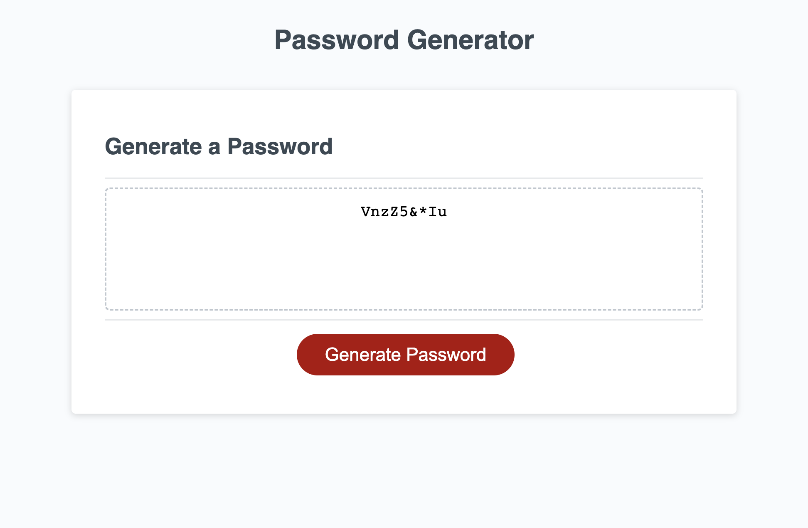

# JS Password Generator

## Table of Contents
* [Description](#description)
* [Photos](#photos)
* [License](#license)
* [Deployed Page](#deployed-page)
* [Contact](#contact)

## Description
A random password generator built using JavaScript to create strong passwords and provide greater security.
How does it work? The user is prompted to choose a password length ranging between 8 and 128 characters. Next, the user is prompted to choose whether they would like to include lower and uppercase letters, numbers, and/or special characters. Lastly, the user's choices are computed to generate a random password.

## Photos

## License
Please refer to the LICENSE in the repo.

## Deployed Page
<a href="https://emiliatrentham.github.io/JS-password-generator/">Deployed Application Link</a>

## Contact
<a href="https://www.linkedin.com/in/emilia-trentham-987a59164/" >LinkedIn: Emilia Trentham</a>

<a href="https://github.com/emiliatrentham%22%3EGithub:">GitHub: emiliatrentham</a>